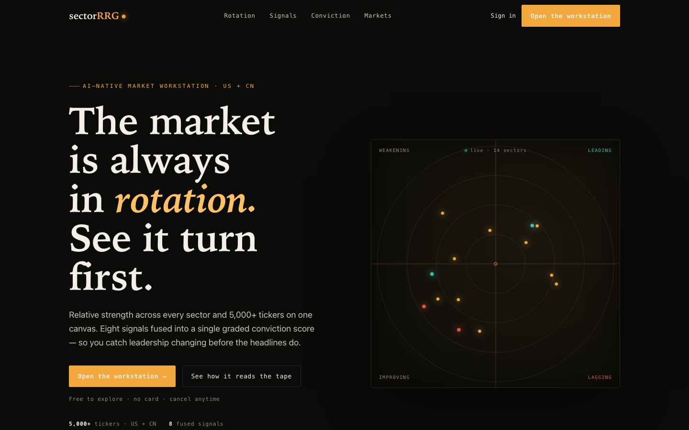

# fantastic-ui

**An agent skill that teaches Claude to build instrument-grade UI — landing pages that read like the product itself, and product surfaces (app pages, dashboards, panels, subpanels) held to the same discipline.**

<p align="center">
  
</p>

<p align="center"><em>Built with this skill: zero webfonts, zero UI libraries, one accent color, and a hero that is the product actually running on a &lt;canvas&gt;.</em></p>

---

## Why this exists

Ask an AI for a landing page and you usually get the same page everyone gets: centered headline, gradient blob, three feature cards with icons, `#6366f1`. It looks like a template because it *is* one — the statistical average of every landing page ever shipped.

This skill was distilled from a real redesign that went the other way: a marketing page for a quantitative finance terminal that feels like **holding the instrument**. The methodology generalizes to any product with real data or real behavior to show — dev tools, analytics, infra, fintech, monitoring.

It's not a component library and not a theme. It's the **decision discipline**, with working code for the hard parts.

## The five disciplines

1. **Single-accent color system** — one accent, ground/hairline/ink scales tinted toward it, and semantic colors (up-teal, down-red) that *only ever* appear with their meaning. Color is information, not decoration.
2. **Three-face typography, zero webfonts** — humanist serif display + monospace data face + system sans body, all system stacks. The serif/mono contrast does the work webfonts get hired for, at zero performance cost.
3. **Live proof over screenshots** — the hero is the product running on a `<canvas>`: DPR-aware, pauses when the tab hides, renders one static frame under `prefers-reduced-motion`, cleans up completely.
4. **Page rhythm** — alternating texture bands: stat tape, thesis explainer, asymmetric bento with painted sparklines, an AI-generated atmosphere band (≤30 KB webp), an interactive ARIA-correct toggle, honest fine print.
5. **Performance and accessibility as gates, not polish** — a pass/fail ship checklist: reduced-motion paths for every animation, skip link, designed focus rings, no horizontal overflow at 320px, RAF verified stopped when the tab hides.

## Eleven theme presets, with automatic selection

The five disciplines say *how* to design; a preset is a pre-committed answer to *what direction*. The skill ships eleven contrast-validated directions — from Coastal Editorial and Blueprint Mono to Midnight Showroom and Dispatch Yellow — each with a full token block, type pairing, and component grammar.

Selection is part of the workflow, not a menu you're shown: before writing a brief, the skill runs a preset check with three gates — the user named a direction → use it; the codebase already has a token system → **no preset** (recover and extend the existing brief instead of running a second design system); otherwise score the request against a signal table (medium, domain, imagery, density) and apply each preset's disqualifier. One confident match is adopted and announced in a line; near-ties get a short question; a half-fit is refused in favor of a fresh brief, because a stretched preset produces exactly the template output the skill exists to prevent. Data-dense analytics/finance surfaces are a stated gap — those route to the dark instrument direction, never to a preset because it happens to be dark.

## Beyond the landing page: product surfaces

The same five disciplines apply *inside* the product. The skill includes a dedicated workflow for modifying existing app pages, panels, and subpanels:

- **App-level brief and tokens** — one one-sentence direction and one token block on the app shell; page-local colors are forbidden, so every screen draws from the same ground scale and single accent.
- **A six-step retrofit procedure** — audit (inventory + color-literal grep baseline) → brief → mechanical tokens-first commit → shared primitives → screen-by-screen migration (one PR each, highest-traffic first) → a cross-screen consistency gate.
- **Panel anatomy and nesting rules** — a uniform panel skeleton (mono eyebrow head, hairline separation, actions right), depth encoded by ground-scale steps instead of shadows, maximum three nesting levels.
- **States as first-class design** — skeleton loading on the ground scale, honest empty states, error red confined to actual errors, stale-data timestamps.

## Whole-app recursive polish

When the scope is *every* surface — "polish every page, don't miss anything" — a per-screen procedure isn't enough. The skill includes a sweep mode that adds coverage mechanics on top of the retrofit workflow:

- **Inventory by recursive traversal** — walk every route's import tree from the code (modals, drawers, toasts, and command palettes included), deduplicating shared components into single work items; never trust a route-count estimate.
- **Prior-art reconciliation** — detect an existing token system, recover its brief instead of writing a competing one, and extend any existing style-guard tests rather than creating parallel ones. Dual-theme apps get one token vocabulary with light/dark values per token, contrast-validated in both.
- **Shared-primitives-first ordering**, then routes by traffic, with a stated fallback ranking when no analytics exist.
- **Batched migration** — 3–5 surfaces per batch (the batch is the PR unit in sweep mode), a presentation-only diff gate, per-batch a11y pass, and a persistent ledger file that survives session boundaries.
- **Loop-until-dry completion** — the job is done only when a *fresh* re-inventory finds zero unpolished surfaces and the mechanical proofs pass (zero color literals outside the token file, zero axe-core critical/serious). Early stops are recorded as explicitly deferred, never silently dropped.

## The accessibility phase

Accessibility isn't a checklist item here — it's a required **check-and-fix phase** targeting WCAG 2.2 AA, run at three moments:

1. **Token time** — a runnable contrast-matrix script validates every ink×ground and accent×ground pair once (4.5:1 text, 3:1 UI/focus), so every screen inherits compliance; failing pairs are fixed in the token, never locally.
2. **Build time** — landmarks, heading order, real ARIA, canvas/marquee text alternatives built in as you go.
3. **Pre-ship** — automated sweep (axe-core with `wcag22aa` tags + Lighthouse) plus four manual passes (keyboard, screen reader, reduced motion, 320 px / 200 % reflow), a severity triage where critical/serious findings block the ship, then fix and **re-audit to zero blockers**.

The reference includes fix patterns keyed to the design system (two-layer focus rings, semantic-color text variants, ≥24 px target sizes, `aria-live` on refreshing panels) and covers the new WCAG 2.2 criteria most audits miss.

The phase is hardened with lessons from real audits, where the tooling itself was the problem as often as the UI:

- **Never dim text with `opacity-*`** — it survives code review (every class references an approved token), fails contrast anyway, *compounds* through nesting (0.60 × 0.70 = 0.42 alpha → a measured 1.83:1), and creates a stacking context that blinds axe. Semantic tint backgrounds count as grounds in the contrast matrix too.
- **axe `incomplete` ≠ `violations`** — the DevTools extension paints both with the same red SERIOUS card. `incomplete` means "could not compute": each node gets measured by hand and recorded, because on one audit 0 violations + 14 incomplete concealed 9 genuine AA failures — and because chasing "incomplete = 0" makes you restyle compliant UI.
- **Validate the measuring instrument** — four documented bugs that make a hand-rolled contrast checker lie (oklab parsed as RGB, premultiplied-alpha precision loss, ignored gradients, walking past opaque layers), and a two-backdrop resolution technique that sidesteps all of them.
- **Audit the surface that actually renders** — not an error/empty shell, not a file the route never mounts, not dead code; every designed state (loading, empty, error, locked, approved) is a coverage item.
- **Never fake structure** — a column-major DOM gets self-describing cells, not a `role="grid"` that announces wrong coordinates; a dimming that *encodes state* gets a replacement channel before removal, then a re-measure (which is how a pre-existing failure hiding under one was found).
- **Guard every fixed bug class with a mutation-tested regression test** — a guard that has never gone red has never been shown to work.

## Install

**Claude Code (recommended):**

```bash
git clone https://github.com/succtorlin/fantastic-ui.git
cp -r fantastic-ui/skills/fantastic-ui ~/.claude/skills/
```

Or, if you use the `skills` CLI:

```bash
npx skills add succtorlin/fantastic-ui
```

Project-local install works too — copy into `<repo>/.claude/skills/` instead.

## Use

Once installed, Claude picks it up automatically when you ask for things like:

- *"Build a landing page for my API monitoring tool"*
- *"Redesign our homepage, it looks like a template"*
- *"Make this page feel premium"*
- *"Restyle the dashboard panels to match the landing page"*
- *"Apply the same style across all the app's pages and subpanels"*
- *"Polish every single surface of the app — make sure nothing is missed"*
- *"Run a WCAG audit on this page and fix what fails"*
- *"Make the app accessible / fix the contrast and keyboard issues"*
- *"Build the site in the Marigold Report style"* (or any preset — or let the skill pick one)

Or invoke it explicitly: `/fantastic-ui`.

## What's inside

```
skills/fantastic-ui/
├── SKILL.md                        # the methodology + ship checklist
└── references/
    ├── css-architecture.md         # full token system, scoped CSS-module rules, shared primitives
    ├── canvas-hero.md              # annotated live-canvas hero, sparklines, scroll reveals —
    │                               #   with the complete lifecycle contract (DPR / visibility / reduced-motion / cleanup)
    ├── ai-atmosphere.md            # prompt recipe + pipeline for ≤30 KB AI atmosphere backgrounds
    ├── product-surfaces.md         # retrofit procedure for app pages/panels/subpanels: audit → tokens →
    │                               #   primitives → migration, panel anatomy, nesting depth, state design
    ├── theme-presets.md            # eleven named directions with contrast-validated token blocks and
    │                               #   component grammar, plus the signal table and gates for automatic
    │                               #   preset selection (and refusal)
    ├── wcag-audit.md               # WCAG 2.2 AA check-and-fix phase: contrast-matrix script (semantic
    │                               #   tints included), the opacity rule, axe sweep with violations-vs-
    │                               #   incomplete triage, validating your own checker, auditing the real
    │                               #   rendered surface, four manual passes, on-system fix patterns,
    │                               #   mutation-tested guards, re-audit loop
    └── recursive-polish.md         # whole-app sweep mode: recursive surface inventory (dead-code and
                                    #   running-app cross-checks, state variants as coverage items),
                                    #   prior-art reconciliation, batch loop with ledger, loop-until-dry
                                    #   completion with mechanical proofs
```

The skill is framework-light: the worked code is React + CSS modules, but the disciplines (and most of the CSS) transfer directly to Vue, Svelte, or plain HTML.

## License

MIT — see [LICENSE](LICENSE).
